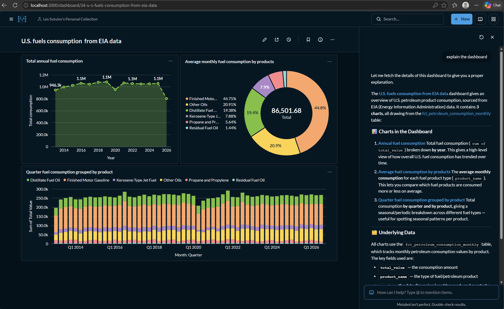

# Data Platform: EIA petroleum data (Airflow + dbt + Metabase)

A learning pet project implementing an ELT pipeline: weekly petroleum data is pulled from the [EIA Open Data API](https://www.eia.gov/opendata/) into Postgres, transformed with dbt, orchestrated by Apache Airflow and explored in Metabase (including the Metabot AI assistant). The original Jaffle Shop dbt project is kept as a learning sandbox.

## Architecture

```
EIA API v2
   │  (Airflow PythonOperator: incremental extract + load)
   ▼
Postgres DWH (dbt-postgres-eia, Docker, port 5433)
│
├── raw/                                   loaded by Airflow
│   ├── raw_petroleum_input_utilization
│   ├── raw_petroleum_import_export
│   └── raw_petroleum_consumption
│
├── staging/                               dbt: typed, deduplicated (latest loaded_at wins)
│   ├── stg_petroleum_input_utilization
│   ├── stg_petroleum_import_export
│   └── stg_petroleum_consumption
│
└── marts/                                 dbt: analytics tables
    └── fct_petroleum_consumption_monthly  (incremental, monthly aggregate by product)
                │
                ▼
          Metabase (port 3000) + Metabot
```

Schemas are set per layer in `dbt/eia/dbt_project.yml`, and the `generate_schema_name` macro makes dbt use them as-is (`staging`, `marts`) instead of prefixing the target schema.

### Result

The Metabase dashboard "U.S. fuels consumption from EIA data" is built on `marts.fct_petroleum_consumption_monthly`. The side panel shows Metabot explaining the dashboard.



### Airflow DAGs (`airflow/dags/eia/`)

One DAG per EIA dataset, all scheduled `@weekly`:

| DAG | Dataset |
|---|---|
| `rest_api_petroleum_input_utilization` | refinery input / utilization |
| `rest_api_petroleum_import_export` | imports / exports |
| `rest_api_petroleum_consumption` | product supplied (consumption) |

Each DAG has the same shape:

```
extract_load (PythonOperator)        reads MAX(period) from raw, requests only newer data from the API,
      │                              appends to raw.<table>
      ▼
dbt_transform (Cosmos DbtTaskGroup)  runs the staging model and everything downstream of it
```

The EIA API key and the warehouse connection come from Airflow environment variables (`AIRFLOW_VAR_EIA_API_KEY`, `AIRFLOW_CONN_DBT_POSTGRES_EIA`), defined in `airflow/.env`.

## Stack

* Apache Airflow (Astro Runtime, Airflow 3.x) via the Astro CLI
* `astronomer-cosmos` — renders the dbt project as native Airflow tasks
* dbt-core + `dbt-postgres`
* Postgres 16 — data warehouse (separate from Airflow's metadata DB)
* Metabase (`metabase/metabase:latest`) with Metabot, using Anthropic as the AI provider
* Docker Compose, Make

## Repository structure

```
data-platform/
├── airflow/
│   ├── dags/
│   │   ├── eia/                     # EIA pipelines (the main project)
│   │   └── jaffle_shop/             # learning DAGs (Cosmos, branching, retries, ...)
│   ├── docker-compose.override.yml  # mounts ../dbt into the containers, passes env vars
│   ├── requirements.txt
│   └── .env                         # NOT in git: EIA key, DWH connection
├── dbt/
│   ├── eia/                         # dbt project for the EIA data
│   │   ├── models/{staging,marts}/
│   │   ├── macros/generate_schema_name.sql
│   │   └── profiles.yml             # NOT in git
│   └── jaffle_shop/                 # original learning dbt project
├── metabase/
│   ├── docker-compose.yml
│   └── metabase-data/               # Metabase application DB (H2 file)
├── scripts/backup_postgres.sh       # pg_dump of the DWH, keeps the last 3 dumps
├── docker-compose.yml               # Postgres DWH (dbt-postgres-eia)
├── Makefile
└── .env                             # NOT in git, see `.env example`
```

## Configuration

Copy `.env example` to `.env` in the project root and fill it in:

| Variable | Used for |
|---|---|
| `DWH_POSTGRES_USER` / `_PASSWORD` / `_DB` | credentials of the DWH Postgres container |
| `ASTRO_NETWORK_NAME` | name of the Docker network created by Astro, shared by the DWH and Metabase |
| `ANTHROPIC_API_KEY` | Metabot (passed to Metabase as `MB_LLM_ANTHROPIC_API_KEY`) |
| `DBT_ALLOW_EXPERIMENTAL_ADAPTERS`, `DBT_CODE` | dbt settings |

`airflow/.env` additionally needs `AIRFLOW_VAR_EIA_API_KEY`, `AIRFLOW_VAR_DWH_POSTGRES_PASSWORD` and `AIRFLOW_CONN_DBT_POSTGRES_EIA`.

`dbt/eia/profiles.yml` is not in git. Create it with profile name `eia`, target `dev`, pointing at the DWH (`host: dbt-postgres-eia`, port `5432` from inside the Docker network, or `localhost:5433` from the host). The password is read from `DBT_POSTGRES_PASSWORD`.

## Getting started

```bash
make up       # starts Airflow (astro dev start), the DWH Postgres and Metabase
make status   # running containers and existing backups
make down     # backs up the DWH first, then stops everything
make backup   # on-demand pg_dump into backups/postgres/ (last 3 kept)
```

`make up` detects the Astro Docker network and attaches the DWH and Metabase to it, so the three stacks can reach each other by container name.

* Airflow UI: http://localhost:8080
* Metabase: http://localhost:3000

### Running dbt from the host

```bash
cd dbt/eia
dbt build
```

### Metabot (AI assistant)

Set `ANTHROPIC_API_KEY` in the root `.env`; `make up` passes it to Metabase with `docker compose --env-file ../.env`. Check **Admin → AI** in Metabase: it should show "Connected to Anthropic". Metabot works best on saved models and metrics built on top of the marts, so connect the DWH in Metabase (**Admin → Databases**) and save models from `marts.*`.

## What's implemented

* Incremental API extraction (only data newer than `MAX(period)` in raw) with task retries
* Layered dbt project: raw sources → staging (deduplication, typing) → marts
* Incremental mart materialization
* dbt run orchestrated as native Airflow tasks through Cosmos
* Automated Postgres backups on `make down`
* Metabase on top of the warehouse with Metabot enabled via Anthropic


* Jaffle Shop sandbox: seeds, snapshots (SCD2), custom macro, `dbt_utils`, Cosmos vs `BashOperator` comparison, `trigger_rule` notifications

## Author

Learning project, built while following a dbt + Airflow study plan.
